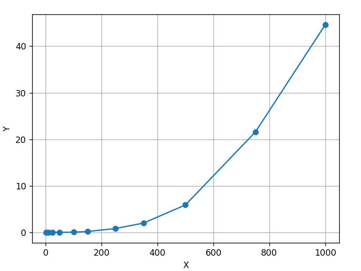

1. Задание: создание программы производящей произведение матриц с исходными данными в файлах, сохраняющий данные в файл. так же создаётся файл со статистикой объём задачи - время выполнения. Так же необходима автоматизированная верификация результата произведения с помощью стронних библиотек питона и визуализация статистики.

2. Выполнение: https://github.com/den3yb/Parallel-prog

3. Результаты экспериментов: Время выполнения программы возраст не линейно, а скорее экспоненциально вместе с увеличением объёмма матриц.

4. Вывод: В ходе выполнения лабараторной работы былы выполнено задания, собранна и проанализированна стистика о времени выполнения взависимости от размера матриц. Выявлена необходимость необходимость оптимизации кода и использования парапараллелизации вычислени.